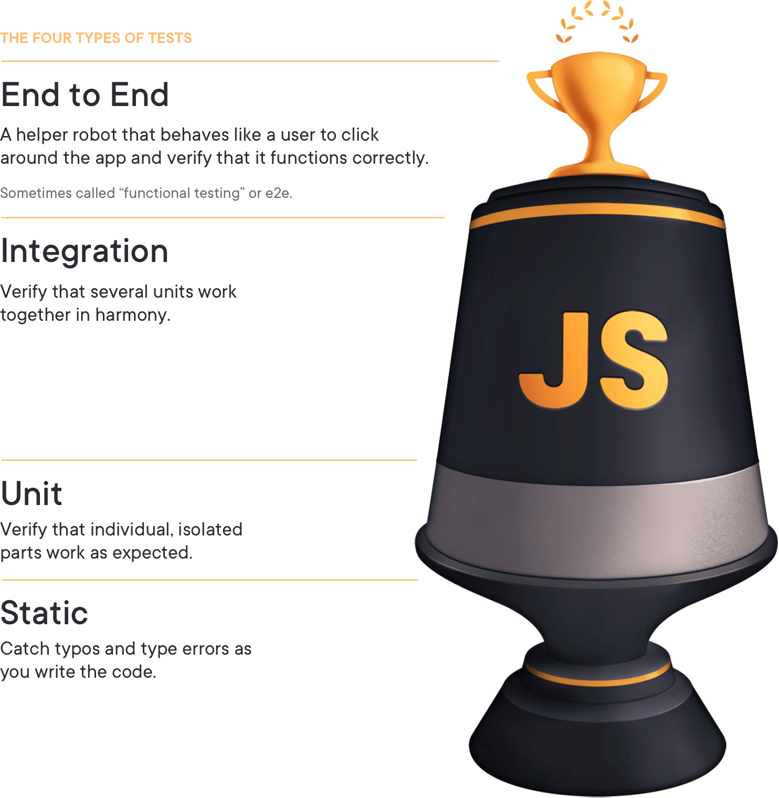

<!-- header: 梅田LT -->
<!-- footer: @www_yto -->

# フロントエンドのテストコード何を書くか

---

<!-- header: フロントエンドのテストコード何を書くか -->

# 自己紹介

- @www_yto(watanabe yuito)
- フロントエンドエンジニア
- SaaS の開発
  - React, Next.js, TypeScript

---

# 話したいこと

- フロントエンドのテスト不要説
- テストの対象/レベル/種類
- どこに張るか

---

# フロントエンドのテスト不要説

---

<!-- header: フロントエンドのテスト不要説 -->

# テスト不要の考え

- フロントエンドはクリーンアーキテクチャで言う所の一番外側
- ドメインがない
- テスト対象(≒ ドメイン)が存在しない/ROI が低い
  

---

# ⭕️ テストはドメインに対して書きたい

# 🤔 フロントエンドにはドメインがない

---

# ドメインとは

知識、影響力、または活動の領域。
ユーザーがプログラムを適用する対象エリアは、ソフトウェアのドメインである。

> A sphere of knowledge, influence, or activity. The subject area to which the user applies a program is the domain of the software.
> —Eric Evans

---

# 👀 > ユーザーがプログラムを適用する対象エリア

- ユーザーがブラウザ上で操作する UI
- ユーザーが入力するフォームやデータ
- ユーザーが発生させるイベントやアクション
- ユーザーが経験する画面遷移と情報表示の流れ

---

# ❌ フロントエンドにはドメインがない

# ⭕️ UI 操作フローのデザイン

# ⭕️ 表示状態の遷移

---

# フロントエンドのドメイン

## ユーザーの操作と状態管理

> [WEB フロントエンドにおけるソフトウェア設計の考察](https://speakerdeck.com/tooppoo/consideration-of-software-design-in-web-front-end?slide=93)

---

# フロントエンドのドメイン

## ui = f(state)

---

# ドメインに対してテストを書きたい!

# 何を? どこに? どのレベルで?

---

<!-- header: "" -->

# テストの対象/レベル/種類

---

<!-- header: テストの対象/レベル/種類 -->

# テストの対象

1. ライブラリが提供する関数
2. ロジックを担う関数
3. UI を表現する関数
4. Web API クライアント
5. API サーバー
6. DB サーバー

---

# テスト種類

1. 機能テスト
2. 非機能テスト
3. ホワイトボックステスト
4. リグレッションテスト

---

# テストレベル

1. 静的テスト(Static)

   - typo や型エラー

2. ユニットテスト(Unit)

   - 依存関係を持たない

3. 結合テスト(Integration)

   - 複数の unit を統合。(できるだけモックを使用しない)

4. E2E テスト(End to End)

   - モックを使用しない

---

# トレードオフ

- ## 壊れやすさ
- ## 速さ
- ## 信頼性

---

<!-- header: "" -->

# どこに張るか

---

<!-- header: どこに張るか -->

# (再掲)フロントエンドのドメイン

## ユーザーの操作と状態管理

> [WEB フロントエンドにおけるソフトウェア設計の考察](https://speakerdeck.com/tooppoo/consideration-of-software-design-in-web-front-end?slide=93)

---

### 静的テスト

😩 ドメインのテストはできない

### 単体テスト

😩 適切に呼び出されているかわからない

> https://x.com/erinfranmc/status/1148986961207730176?s=20

### E2E テスト

😩 壊れやすい

---

# 統合テスト

ユーザー操作(ユースケース)を網羅できる

テスティングトロフィー

> https://www.testingjavascript.com/

---

# 統合テスト例

1. セレクトボックスの操作する
2. URL の検索クエリが変化する
3. 検索クエリの変化により、データ取得 API が呼ばれる
4. 一覧表示内容が更新される

---

<!-- header: フロントエンドのテストコード何を書くか -->

# まとめ

- フロントエンドにもドメインはある
  - ユーザーの操作
  - 状態管理
- 統合テストを厚く書く
  - ユーザー操作を網羅
  - 信頼性,スピード,コストのトレードオフのバランスが良い

---

# 参考

- [WEB フロントエンドにおけるソフトウェア設計の考察](https://speakerdeck.com/tooppoo/consideration-of-software-design-in-web-front-end)
- [フロントエンドアプリケーションの静的、単体、結合、E2E テスト](https://zenn.dev/takuyakikuchi/articles/3663c0e521408d)
- [Write tests. Not too many. Mostly integration.](https://kentcdodds.com/blog/write-tests)
- [Clean Architecture](https://blog.cleancoder.com/uncle-bob/2012/08/13/the-clean-architecture.html)
- [フロントエンド開発のためのテスト入門 今からでも知っておきたい自動テスト戦略の必須知識](https://www.amazon.co.jp/%E3%83%95%E3%83%AD%E3%83%B3%E3%83%88%E3%82%A8%E3%83%B3%E3%83%89%E9%96%8B%E7%99%BA%E3%81%AE%E3%81%9F%E3%82%81%E3%81%AE%E3%83%86%E3%82%B9%E3%83%88%E5%85%A5%E9%96%80-%E4%BB%8A%E3%81%8B%E3%82%89%E3%81%A7%E3%82%82%E7%9F%A5%E3%81%A3%E3%81%A6%E3%81%8A%E3%81%8D%E3%81%9F%E3%81%84%E8%87%AA%E5%8B%95%E3%83%86%E3%82%B9%E3%83%88%E6%88%A6%E7%95%A5%E3%81%AE%E5%BF%85%E9%A0%88%E7%9F%A5%E8%AD%98-%E5%90%89%E4%BA%95-%E5%81%A5%E6%96%87/dp/4798178187)
